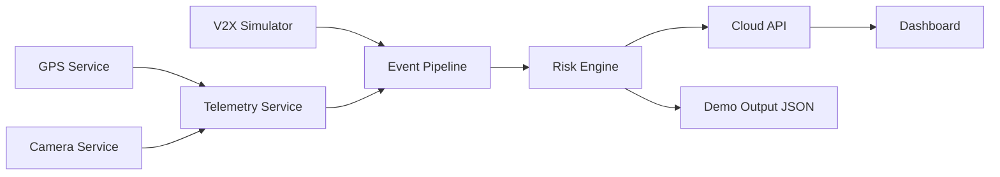

# HCV V2X Predictive Risk Mitigation

Demo-ready edge/cloud reference implementation for heavy commercial vehicle predictive safety intelligence using onboard sensing, simulated cooperative V2X context, deterministic edge risk scoring, and cloud/fleet visibility.

## What The System Does

- Normalizes GPS and camera-derived telemetry into stable service contracts.
- Accepts cooperative V2X context from reproducible simulation events.
- Computes deterministic, explainable risk scores and hazard classifications.
- Generates mitigation recommendations for driver and fleet workflows.
- Publishes events to a local cloud ingestion API.
- Visualizes event outcomes in a lightweight dashboard.

## Architecture Overview



## Repository Structure

```text
.
├── README.md
├── CONTRIBUTING.md
├── SECURITY.md
├── CODE_OF_CONDUCT.md
├── requirements-dev.txt
├── scripts/
│   ├── run_all_tests.sh
│   ├── run_demo_end_to_end.py
│   └── run_demo_end_to_end.sh
├── docs/
│   ├── architecture/
│   ├── demo/
│   ├── development/
│   ├── operations/
│   └── patent-alignment/
├── services/
│   ├── camera-service/
│   ├── gps-service/
│   ├── telemetry-service/
│   ├── v2x-simulator/
│   ├── risk-engine/
│   ├── pipeline/
│   ├── cloud-api/
│   └── dashboard/
└── outputs/
```

## Services

- `services/gps-service`: GNSS parsing with mock and serial-compatible data paths.
- `services/camera-service`: camera metadata, health state, and deterministic analytics proxies.
- `services/telemetry-service`: normalization of sensor/vehicle payloads to consistent telemetry events.
- `services/v2x-simulator`: reusable cooperative context events and mapping to risk context.
- `services/risk-engine`: deterministic and explainable risk scoring + mitigation outputs.
- `services/pipeline`: local orchestration from sensor input through risk event generation.
- `services/cloud-api`: ingest API server plus client adapter utilities.
- `services/dashboard`: Streamlit-based local review surface for event monitoring.

## Quick Start

```bash
python -m venv .venv
```

macOS/Linux:

```bash
source .venv/bin/activate
```

Windows:

```powershell
.venv\Scripts\activate
```

```bash
pip install -r requirements-dev.txt
bash scripts/run_all_tests.sh
python scripts/run_demo_end_to_end.py
```

## Run Cloud API

```bash
cd services/cloud-api/server
python -m uvicorn main:app --host 127.0.0.1 --port 8000
```

## Run Dashboard

```bash
streamlit run services/dashboard/app.py
```

## Run Pipeline With V2X

```bash
python services/pipeline/src/pipeline_runner.py --no-external-context --v2x-event services/v2x-simulator/examples/v2i_curve_warning.json
```

## Demo Output Example

```text
HCV V2X Predictive Risk Mitigation Demo
---------------------------------------
Vehicle ID: hcv-demo-001
Trip ID: demo-trip-001
Risk Score: 0.72
Severity: high
Hazard Type: speed_curve_environment
Driver Alert: Elevated risk - reduce speed and increase following distance.
Fleet Notification: true
Reason Codes: rule.speed_curve_no_confirmed_wet, v2x.v2i_curve_warning
Cloud Ingest: success
Output File: outputs/demo_run_20260429T120000Z.json
```

## Current Capabilities

- Edge risk scoring with deterministic rules.
- GPS ingest and mock GPS support.
- Camera health and metadata capture.
- Telemetry normalization for service boundaries.
- V2X context simulation and context merging.
- Local pipeline orchestration and output artifact generation.
- Cloud event ingestion and retrieval.
- Dashboard-based event review.
- Testable modular services suitable for external contribution.

## Known Limitations

- V2X is simulated for demo purposes.
- Vehicle CAN input is represented by normalized sample telemetry.
- Camera intelligence uses lightweight heuristics unless real CV models are added.
- Cloud analytics currently focus on ingestion and review, not trained fleet-scale prediction.
- Production vehicle control integration is out of scope.

## Contributing

See `CONTRIBUTING.md`.

## Security

See `SECURITY.md`.

## Roadmap

- Jetson live hardware validation.
- CAN/OBD-II integration.
- MQTT or C-V2X gateway adapter.
- Azure deployment patterns.
- Fleet analytics expansion.
- Model-based risk prediction.
- Authentication and device identity.
- Containerized deployment profiles.
