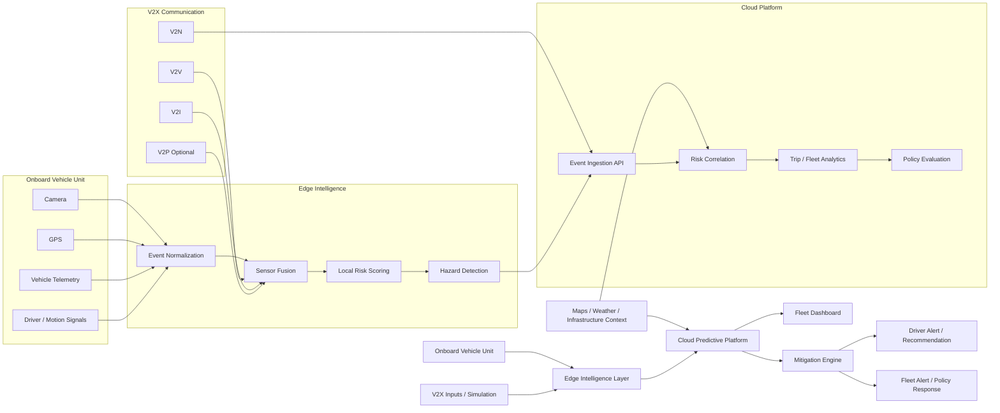
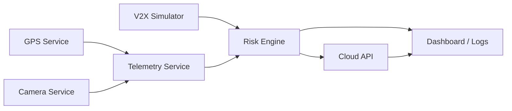

# Architecture Diagram

## High-Level Architecture

## Phase 1 Implementation View

## Planned Service Boundaries

- `camera-service`: frame capture and derived event metadata
- `gps-service`: route, speed, heading, and timestamp ingestion
- `telemetry-service`: normalized event contracts
- `risk-engine`: local scoring and hazard classification
- `v2x-simulator`: cooperative safety event injection for POC use
- `cloud-api`: ingestion endpoint and fleet-side aggregation
- `dashboard`: visualization of trips, alerts, and mitigation outputs
