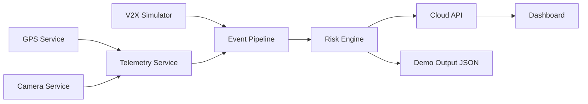
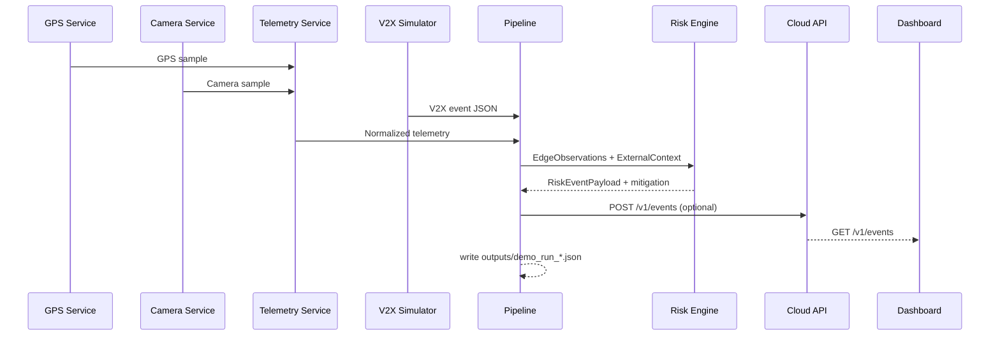

# Architecture

## High-Level Architecture

```mermaid
flowchart LR
  GPS[GPS Service] --> TEL[Telemetry Service]
  CAM[Camera Service] --> TEL
  V2X[V2X Simulator] --> PIPE[Event Pipeline]
  TEL --> PIPE
  PIPE --> RISK[Risk Engine]
  RISK --> API[Cloud API]
  API --> DASH[Dashboard]
  RISK --> OUT[Demo Output JSON]
```

## Local Demo Sequence

```mermaid
sequenceDiagram
  participant G as GPS Service
  participant C as Camera Service
  participant T as Telemetry Service
  participant V as V2X Simulator
  participant P as Pipeline
  participant R as Risk Engine
  participant A as Cloud API
  participant D as Dashboard

  G->>T: GPS sample
  C->>T: Camera sample
  V->>P: V2X event JSON
  T->>P: Normalized telemetry
  P->>R: EdgeObservations + ExternalContext
  R-->>P: RiskEventPayload + mitigation
  P->>A: POST /v1/events (optional)
  A-->>D: GET /v1/events
  P-->>P: write outputs/demo_run_*.json
```

## Data Contract Overview

- `telemetry-service` outputs `NormalizedTelemetryEvent`.
- `risk-engine` consumes normalized edge/context and outputs `riskEvent`.
- `cloud-api` ingests `EventV1` through adapter mapping.
- `dashboard` reads ingested payloads and extracts risk/mitigation fields defensively.

## Edge/Cloud Responsibility Split

- **Edge side**: GPS, camera, telemetry normalization, V2X mapping, risk scoring, output artifact creation.
- **Cloud side**: event ingestion, persistence, event retrieval, simple enrichment for review.
- **Simulated V2X**: reproducible cooperative context for demo and test runs.
- **Dashboard**: local fleet-review surface for latest risk state and event table.

## Future Jetson Deployment

Current implementation is laptop-friendly by default and supports optional hardware paths. Jetson adaptation can preserve service boundaries by replacing mock sensor inputs with live sensor adapters and adding deployment packaging.
