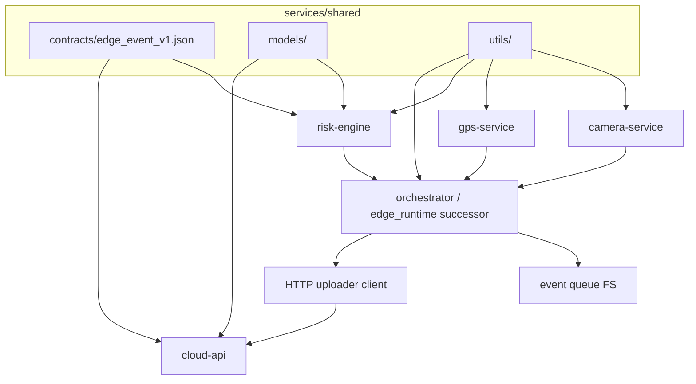

# Service migration plan (Phase 1)

This plan coordinates gradual extraction from **`jetson-hcv-risk-poc/`** (unchanged baseline) into **`services/*`** without breaking existing systemd entrypoints that run `python -m app.record_session` and `python -m app.edge_runtime` from `jetson-hcv-risk-poc/edge/`.

Authoritative POC layout reference: `docs/current-jetson-poc-status.md`.

---

## Migration order

| Step | Target | POC sources (copy or wrap first) | Rationale |
|------|--------|-----------------------------------|-----------|
| 1 | `services/shared/contracts/` | Keep `edge_event_v1.json` aligned with `jetson-hcv-risk-poc/contracts/event_v1.json` | Single contract visible to new packages; CI can diff the two until one source remains |
| 2 | `services/shared/utils/` + `services/shared/models/` | `edge/app/recording_paths.py`, `_resolve_output_base` / `_to_iso_z` patterns from `edge/app/edge_runtime.py` | Pure helpers reduce duplication before hardware-bound code moves |
| 3 | `services/risk-engine/src/` | `edge/risk_engine/scorer.py`, `context_provider.py`, `edge/inference/perception_adapter.py` | No OpenCV/serial; highest test signal / lowest Jetson variance |
| 4 | `services/gps-service/src/` | `edge/gps_service/reader.py`, `edge/app/recording_gps_writer.py` | Clear I/O boundary; depends on `pyserial` only |
| 5 | `services/camera-service/src/` | `edge/camera_service/capture.py`, `edge/app/recording_video.py` | OpenCV/GStreamer coupling; migrate after shared path/time helpers exist |
| 6 | Orchestration (future package or `risk-engine` extra) | `edge/event_store/queue.py`, `edge/uploader/client.py`, loop from `edge/app/edge_runtime.py` | Ties filesystem layout, scoring, queue, HTTP—safest once steps 1–5 compile and tests call new APIs |
| 7 | `services/cloud-api/src/` | `jetson-hcv-risk-poc/cloud/api/*`, `cloud/deploy/*` | Independent deployable; edge `ingest_base_url` already points here in YAML |

**Intentional sequencing:** contracts and pure logic before **camera** and **monolithic runtime**, so Jetson-less CI can gate most PRs.

---

## Dependencies between services

- **`shared`** has no dependency on other `services/*` packages.
- **`camera-service`** and **`gps-service`** should not import each other; a future orchestrator composes them (today: `record_session.py`).
- **`risk-engine`** consumes normalized dicts (GPS row, perception/context dicts); it must not read `/dev/video*` or serial directly in the steady state.
- **`cloud-api`** depends only on **`shared/contracts`** (and later **`shared/models`** if Pydantic models are lifted) plus its own DB layer.
- **Uploader** (`edge/uploader/client.py`) is an **edge outbound** dependency of the orchestrator on **`cloud-api`** HTTP—no circular edge/cloud package import.

---

## Rollback-safe approach

1. **Never delete or rewrite** `jetson-hcv-risk-poc/` during migration; treat it as production baseline until systemd units are explicitly repointed.
2. **Dual validation period:** run existing `pytest tests/` under POC unchanged; add **new** tests under `services/<name>/tests/` that import extracted code. Gate merges on both until cutover.
3. **Schema lockstep:** if `edge_event_v1.json` changes, update `jetson-hcv-risk-poc/contracts/event_v1.json` in the same PR (or document temporary divergence with a ticket)—avoids silent ingest failure on `POST /v1/events`.
4. **Systemd last:** only after `python -m app.edge_runtime` can be swapped to a thin launcher that calls installed packages (or a new module path), update `edge/deploy/*.service` `WorkingDirectory` / `ExecStart` in a dedicated change with board smoke test.
5. **Feature parity checklist per step:** recording folder layout, `phase1_events/pending|sent`, `CloudUploader` headers, `min_emit_band` behavior—tick explicitly before removing POC duplicates.

---

## Reuse vs wrap

| Strategy | When to use | Example |
|----------|-------------|---------|
| **Reuse (move + fix imports)** | Module is self-contained, few `sys.path` assumptions | `scorer.py`, `reader.py` after package layout exists |
| **Wrap (thin adapter in `services/.../src`)** | Code must still run from POC tree during transition | Adapter that `importlib` loads POC `edge_runtime` helpers, or subprocess to unchanged CLI—discouraged long-term |
| **Copy then delete later** | Need stable API in `services/` while POC stays canonical for a sprint | Duplicate `edge_event_v1.json` with CI diff to POC `event_v1.json` |

Prefer **reuse via moved source** once `pyproject.toml` / namespace packages define installable `hcv_camera`, `hcv_gps`, etc.—wrappers add indirection cost.

---

## Adapters to old code (initial phase)

Until imports are fully lifted:

1. **Path shim (short-term only):** a launcher in `services/risk-engine/tests` or a dev script prepends `jetson-hcv-risk-poc/edge` to `sys.path` to import legacy `risk_engine`—document as **temporary**; remove when package is on `PYTHONPATH` via editable install.
2. **Orchestrator stays in POC:** `edge/app/edge_runtime.py` continues to own the loop; first integration test can call **new** `score_risk` from `services/risk-engine` side-by-side with old import and assert identical outputs on golden YAML.
3. **Cloud:** run existing `uvicorn main:app` from POC path; `services/cloud-api` receives **copied** `main.py`/`schemas.py` only when Docker build context is ready—until then, README in `services/cloud-api` is the contract for where code will land.

---

## Open decisions (Phase 1)

- **Event queue ownership:** keep `edge/event_store/queue.py` with **`risk-engine`** vs separate **`event-store`** service folder—decide before splitting `edge_runtime`.
- **Edge-side JSON Schema validation:** POC does not validate before POST; adding validation in `risk-engine` or uploader is optional hardening, not required for parity.

---

*Update this document when the first package is installable from `services/` and when systemd cutover is scheduled.*
