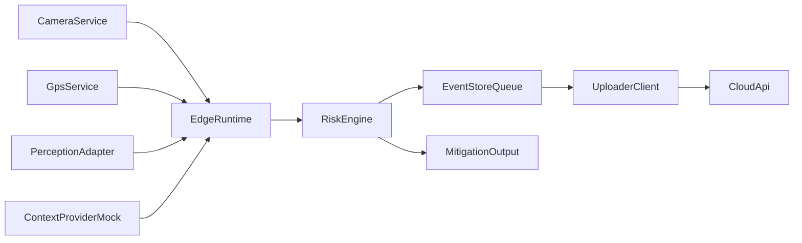

# Phase 1 POC Architecture

**IP context:** This phase implements part of the roadmap in [docs/patent/PHASED_IMPLEMENTATION.md](docs/patent/PHASED_IMPLEMENTATION.md) (utility model: [docs/patent/utility-model-specification.md](docs/patent/utility-model-specification.md)).

## Product Summary

This POC targets a practical closed-loop safety workflow for heavy commercial vehicles:

1. Sense environment and vehicle location on edge hardware.
2. Estimate risk on the Jetson in near real time.
3. Persist and uplink risk events to cloud services.
4. Enrich event timelines with external context (mocked in Phase 1).
5. Generate mitigation outputs for driver cautioning and fleet alerting.

Phase 1 favors reliability, observability, and demo repeatability over production-grade autonomy.

## Major Subsystems

- **Edge sensing**: camera and GPS capture services.
- **Edge runtime**: perception/context adapters, risk scoring, mitigation decision, event emission.
- **Edge event store**: local durable queue for offline-first behavior.
- **Edge uploader**: idempotent POST to cloud ingest API.
- **Cloud ingest/persistence**: contract-validated ingest and query API.
- **Contract boundary**: `event_v1` schema as payload authority between edge and cloud.

## Phase 1 POC Scope

### In scope (demo minimum)

- Real camera recording and GPS serial capture on Jetson.
- Deterministic mock perception and mock context provider.
- Heuristic risk scoring with reason codes and risk bands.
- Local event queue with retry upload to cloud `/v1/events`.
- Driver advisory and fleet alert flags attached to event stream.

### Acceptance criteria

- Camera and GPS services run independently without mutual failure coupling.
- `edge_runtime` emits contract-valid `event_v1` payloads.
- Network outage does not lose events; queue drains after connectivity returns.
- Demo shows at least 3 distinct risk bands from one repeatable scenario.
- Cloud API lists uploaded events with payload integrity preserved.

## Mock vs Real Components

### Real in Phase 1

- Camera capture and recording.
- GPS ingest and timestamping.
- Event queueing and cloud upload transport.

### Mocked in Phase 1

- Perception model outputs (distance, closure rate, lane departure risk).
- External V2X context (traffic/weather/road risk).
- Hard actuation paths (CAN/OBD and vehicle control).

### Hybrid

- Risk uses real GPS quality and timing plus deterministic mock perception/context.

## Proposed Architecture

### Runtime modules

- `edge/inference/perception_adapter.py`
- `edge/risk_engine/context_provider.py`
- `edge/risk_engine/scorer.py`
- `edge/event_store/queue.py`
- `edge/uploader/client.py`
- `edge/app/edge_runtime.py`

### Service topology

- `hcv-camera-record.service` (camera producer)
- `hcv-gps-record.service` (GPS producer)
- `hcv-edge-runtime.service` (consumer/scoring/uploader)

## End-to-End Flow

1. Camera and GPS producers write local artifacts under the recordings path.
2. Edge runtime samples latest GPS fix and camera health.
3. Perception and context adapters provide deterministic demo features.
4. Risk engine computes `score`, `band`, and `reason_codes`.
5. Runtime creates `event_v1` payload with mitigation metadata.
6. Event is queued to durable local storage (`pending`).
7. Uploader posts queued events to cloud API and moves acknowledged files to `sent`.
8. Cloud stores payloads and exposes them for fleet/demo dashboards.

## Risks and Assumptions

- Inverter power instability can still disrupt USB peripherals; boot delay and restart policies are required.
- Clock drift and sparse GPS updates can affect event alignment quality.
- Cloud API remains unauthenticated in this phase unless `api_key` validation is later enforced.
- Perception/context are simulated, so risk outputs are representative but not safety-certified.
- Phase 1 mitigation is advisory only and must not be treated as autonomous control.
